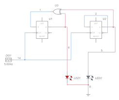
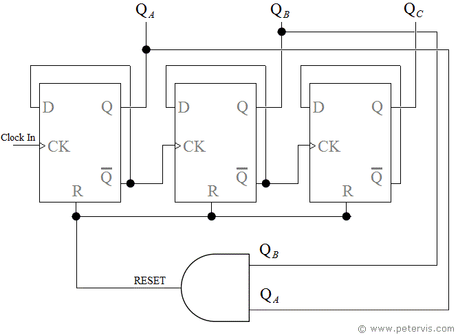
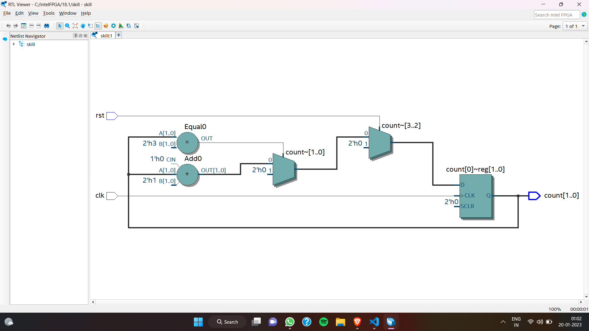
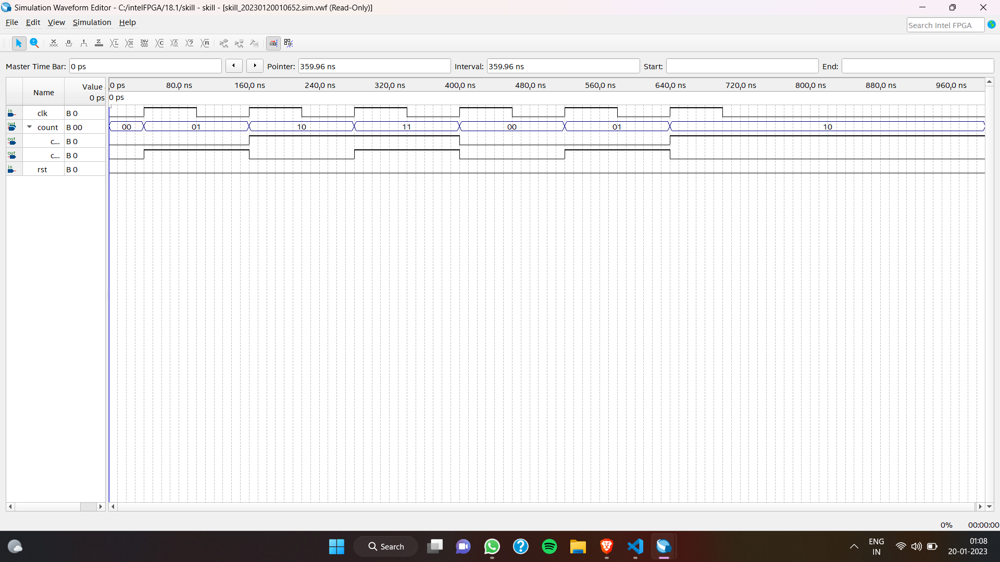

# Title: 
Design and Simulation of a Mod 3 Synchronous Counter using Verilog

## Aim: 
The aim of this project is to design and simulate a mod 3 synchronous counter using Verilog programming language.

## Introduction: 
A counter is a sequential logic circuit that counts the number of input pulses applied to it. Synchronous counters are those counters in which the flip-flops are triggered by a common clock signal. In this project, we will be designing a mod 3 synchronous counter, which means it will count from 0 to 2 and then reset to 0 again.

## Program:
.png)

## Logic Diagram: 
The logic diagram for the mod 3 synchronous counter is shown below:

## Logical Expression: 
The logical expression for each flip-flop in the mod 3 synchronous counter is given below:
Q0 = Q0 + CLK
Q1 = Q0

## Block Diagram: 
The block diagram for the mod 3 synchronous counter is shown below:

## Truth Table/Excitation Table: 
The truth table for the mod 3 synchronous counter is given below:

## Explanation: 
The mod 3 synchronous counter counts the number of input pulses applied to it. The counter starts counting from 0 and increments the count by 1 with each input pulse. When the count reaches 2, it resets to 0 and starts counting again. The truth table shows the current state and next state of the counter with each input pulse.

## RTL Diagram: 
The RTL diagram for the mod 3 synchronous counter is shown below:

## Timing Diagram: 
The timing diagram for the mod 3 synchronous counter is shown below:

## Result: 
The simulation results show that the mod 3 synchronous counter is working as expected and counting the input pulses correctly. It counts from 0 to 2 and then resets to 0 again. The simulation results match the expected results from the truth table and timing diagram.
